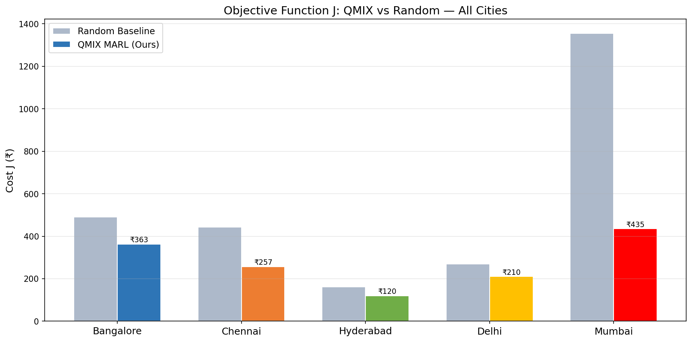
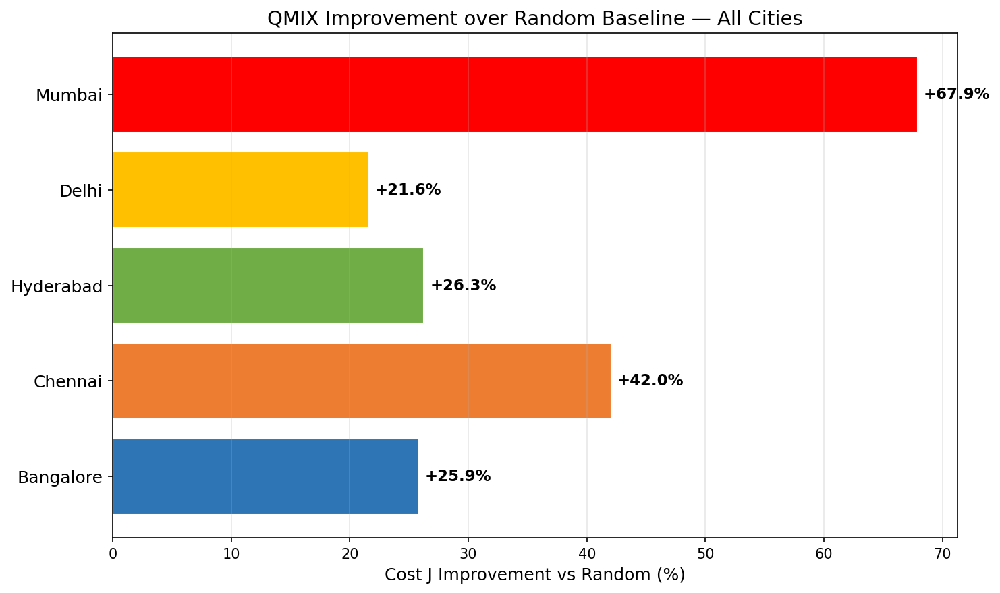
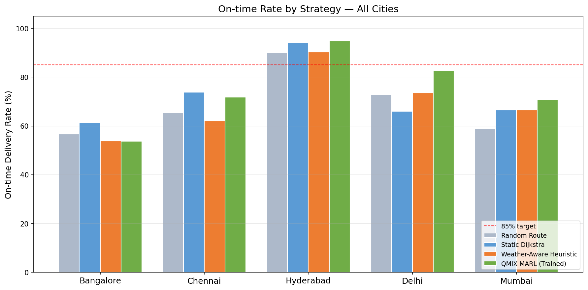
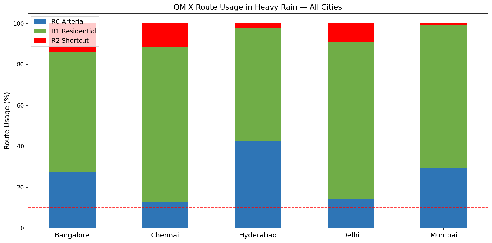

## Adaptive MARL Path Planning — QMIX Multi-Agent Coordination
This repository contains a PyTorch implementation of a **QMIX-based Multi-Agent Reinforcement Learning (MARL)** system designed for dynamic path planning, agent coordination, and collision avoidance in non-stationary spatial environments. 

> ### 🎯 Context & Research Scope
> 
> My research explores autonomous spatial systems across two distinct layers:
> * **Perception Layer:** Covered in my *Transient Object Detection* work (3D scene reconstruction).
> * **Decision-Making Layer (This Repository):** Focuses on multi-agent spatial coordination, path planning, and collision avoidance in dynamic environments using QMIX.


**Contents**
- `train.py` — training loop that saves models and `results/training_log.pkl`.
- `evaluate.py` — runs evaluation episodes and writes `results/eval_results.pkl`.
- `visualize.py` — generates publication-quality figures from saved results.
- `road_network.py` — OSM-backed or stubbed road network utilities.
- `config.py` — experiment configuration and paths.
- `models/`, `results/`, `logs/` — model checkpoints, plots, and logs.

**Prerequisites**
- Python 3.11+ (virtualenv recommended)
- Create and activate a venv in the repo root:

```bash
python -m venv .venv
.
# On Windows PowerShell
.\.venv\Scripts\Activate.ps1
```

- Install dependencies:

```bash
pip install -r requirements.txt
```
### Option A: Local Virtual Environment 

Python 3.11+ 
Create and activate a venv in the repo root:
python -m venv .venv
.
# On Windows PowerShell
.\.venv\Scripts\Activate.ps1
Install dependencies:
pip install -r requirements.txt

### Option B: Docker Setup 


Launch the container terminal 

docker compose run --rm app bash 


**Quick Usage**

- Train (example):

```bash
python train.py --episodes 3000
```

- Evaluate (example):

```bash
python evaluate.py --model_dir models/final --n_episodes 100
```

- Visualize saved results (generates PNGs in `results/`):

```bash
python visualize.py
```

- Plot demo routes on a map (requires `osmnx` and `networkx` or falls back to a stub):

```bash
python visualize.py --plot_routes_on_map
```

You can also provide a pickle file containing `routes_data` (list of dicts with `waypoints`, `color`, `label`) using `--routes routes.pkl`.

### 📊 Experimental Analysis & Baselines

* `run_all_cities.py`: **Multi-City Pipeline** — Sequentially trains and evaluates the model across all target road networks to verify cross-city generalizability.
* `run_rl_baselines.py`: **Algorithm Benchmarking** — Runs comparative evaluations against standard MARL architectures (DQN, IQL, VDN, MAPPO) under identical environment constraints.
* `ablation_study.py`: **Feature Validation** — Systematically toggles individual dynamic inputs (e.g., weather signals, flood risk levels) to isolate and prove the value of each component.
* `compare_cities.py`: **Metric Aggregation** — Compiles raw evaluation data into cross-city comparison tables and generates visual performance plots (`.png`).

### 📈 Cross-City Results

The trained QMIX policy was evaluated across five Indian cities against a random-routing baseline and additional routing strategies. Lower objective cost $J$ is better, while higher on-time delivery rate is better.

#### Objective Cost and Improvement over Random

| City | Random Baseline Cost J (₹) | QMIX Cost J (₹) | Improvement vs Random |
|---|---:|---:|---:|
| Bangalore | 490 | 363 | **25.9%** |
| Chennai | 443 | 257 | **42.0%** |
| Hyderabad | 163 | 120 | **26.3%** |
| Delhi | 268 | 210 | **21.6%** |
| Mumbai | 1,355 | 435 | **67.9%** |

Across all five cities, QMIX reduces the objective cost relative to random routing, with the largest gain observed in **Mumbai (67.9%)**, followed by **Chennai (42.0%)**.

#### On-Time Delivery Rate

| City | Random Route | Static Dijkstra | Weather-Aware Heuristic | QMIX MARL |
|---|---:|---:|---:|---:|
| Bangalore | 56.5% | 61.2% | 53.6% | 53.6% |
| Chennai | 65.3% | **73.7%** | 61.9% | 71.7% |
| Hyderabad | 90.0% | 94.0% | 90.0% | **94.7%** |
| Delhi | 72.8% | 65.8% | 73.5% | **82.5%** |
| Mumbai | 58.8% | 66.4% | 66.4% | **70.7%** |

QMIX achieves the strongest on-time rate in **Hyderabad, Delhi, and Mumbai**, reaching approximately **94.7%**, **82.5%**, and **70.7%**, respectively.

#### QMIX Route Usage under Heavy Rain

| City | R0 Arterial | R1 Residential | R2 Shortcut |
|---|---:|---:|---:|
| Bangalore | 27.7% | **58.5%** | 13.8% |
| Chennai | 12.7% | **75.6%** | 11.7% |
| Hyderabad | 42.6% | **54.8%** | 2.6% |
| Delhi | 14.0% | **76.6%** | 9.4% |
| Mumbai | 29.2% | **70.1%** | 0.7% |

Under heavy-rain conditions, the learned policy consistently shifts toward **R1 residential routes** and sharply reduces use of **R2 shortcuts**, indicating adaptive route selection under adverse weather.

#### Result Visualizations










**Output Files**
- `results/learning_curves.png` — three-panel plot: Cost J, On-time rate (with 90% target line), and TD loss. Shows raw values and a moving average.
- `results/epsilon_decay.png` — epsilon values over episodes (exploration → exploitation).
- `results/comparison_chart.png` — bar chart comparing strategies (mean cost and on-time rate).
- `results/training_log.pkl` — pickled training metrics used by `visualize.py`.
- `results/eval_results.pkl` — pickled evaluation summary used by `visualize.py`.

